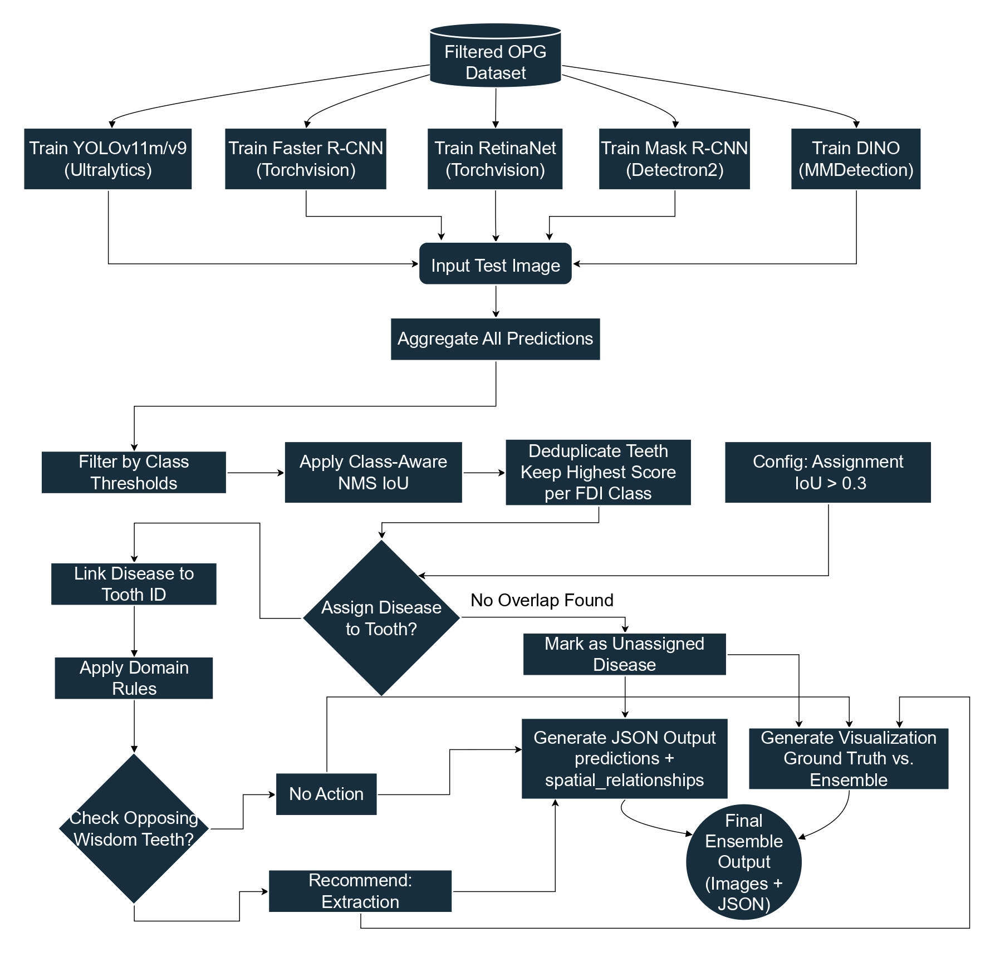
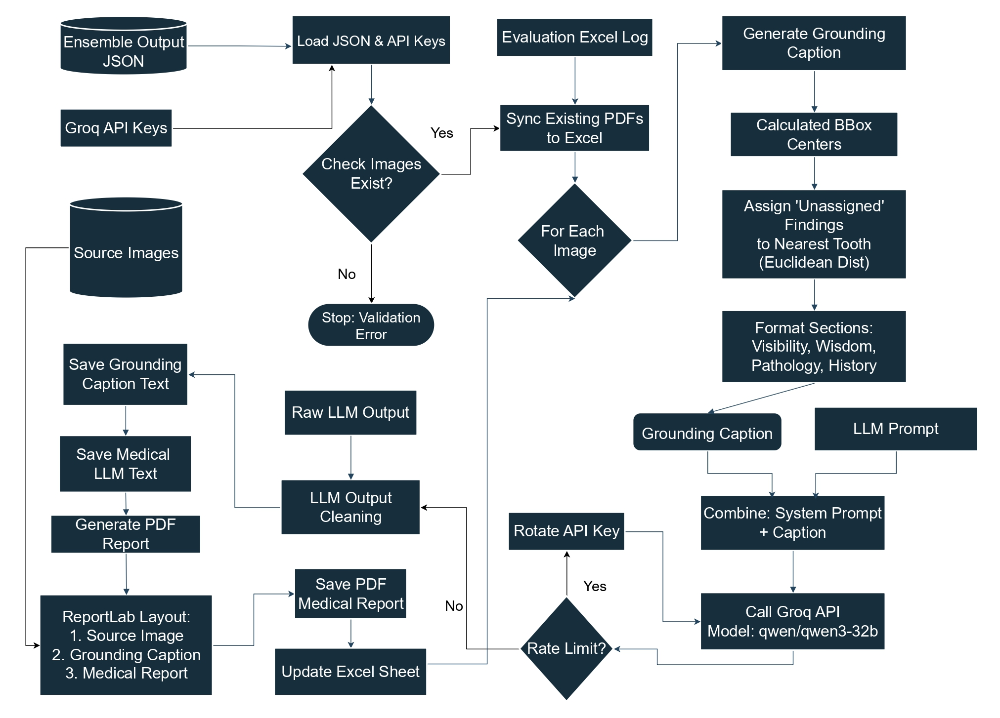
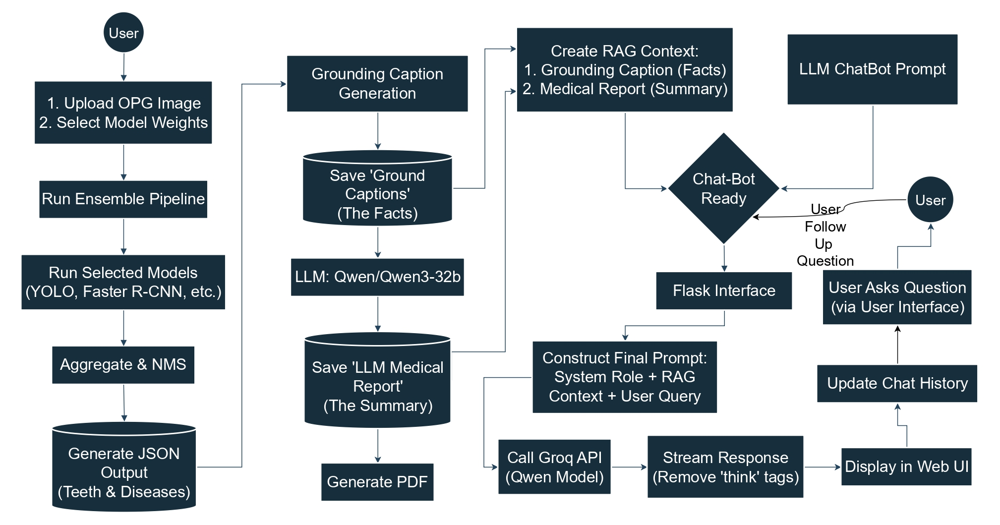
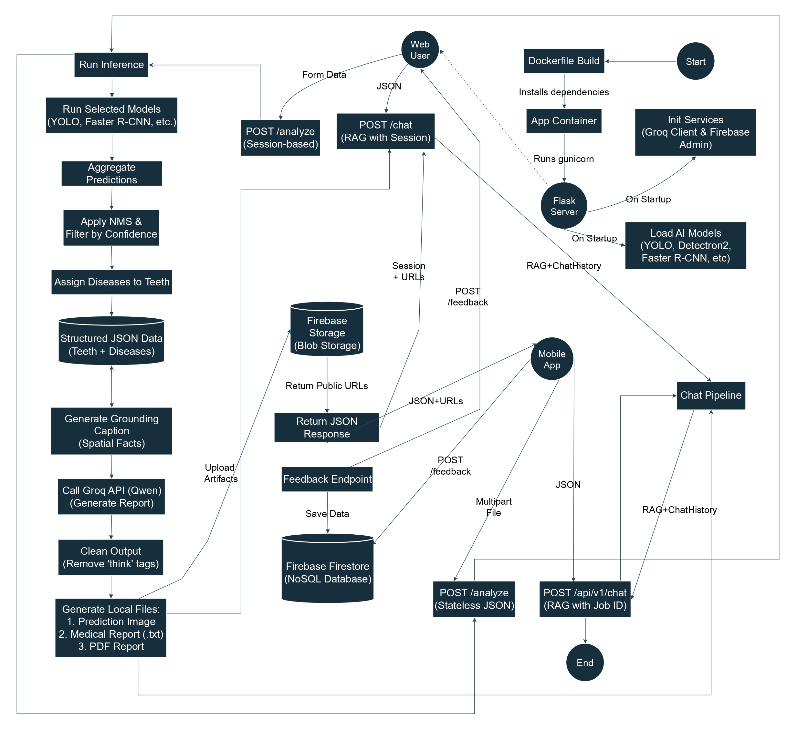

# AI The Dentist: Multimodal Dental Diagnostics: Comparative Detection Modeling and LLM-Powered Report Generation with Interactive RAG Assistance.

**Dissertation Project** | **MSc in Artificial Intelligence**
*Bridging Computer Vision and Large Language Models in Dentistry*

---
## 🎥 Demo Video
<video width="640" height="360" controls>
  <source src="media/ai_the_dentist.mp4" type="video/mp4">
  Your browser does not support the video tag.
</video>

<!--[](media/ai_the_dentist.mp4)  -->


## 📖 Overview
<p align="center">
    
</p>

This repository contains the official implementation of my Master's dissertation: **"AI The Dentist: Multimodal Dental Diagnostics: Comparative Detection Modeling and LLM-Powered Report Generation with Interactive RAG Assistance."**

The project proposes a novel, end-to-end framework that automates the dental diagnostic workflow. By integrating **Ensemble Deep Learning** for detection with **Large Language Models (LLMs)** for reporting and **Retrieval-Augmented Generation (RAG)** for patient interaction, this system bridges the gap between complex radiological data and patient-centric communication.

### 🚀 Key Features

* **Ensemble Detection Engine:** A voting system combining 5 architectures (YOLOv11, Faster R-CNN, RetinaNet, Mask R-CNN, DINO) to detect pathologies in low-resolution OPGs.
* **Clinical Logic Layer:** A post-processing module that maps detections to FDI tooth numbers using spatial relationship logic.
* **Automated Medical Reporting:** Generates professional PDF reports using a Grounded Qwen-2.5 LLM pipeline.
* **AI Dental Assistant:** A RAG-based chatbot that "reads" the patient's specific report to answer questions in layman's terms.
* **Full-Stack Deployment:** Available as a cloud-native web app and mobile application (iOS/Android).

---

## 🔗 Live Demo & Downloads

Experience the full system through the links below:

| Platform              | Link                                                                                      | Status  |
| :-------------------- | :---------------------------------------------------------------------------------------- | :------ |
| **Web Demo**    | [**Hugging Face Space**](https://huggingface.co/spaces/tym24/AI-the-Dentist)           | 🟢 Live |
| **iOS App**     | [**Download via TestFlight**](https://testflight.apple.com/join/pH9TB7UE)              | 🟢 Beta |
| **Android App** | [**Download via App Tester**](https://appdistribution.firebase.dev/i/9d9170c6a3831c0d) | 🟢 Beta |

> **Note:** For mobile apps, you may need to install *TestFlight* (iOS) or *Firebase App Tester* (Android) first.

---

## 📂 Repository Structure

The codebase is modularized by pipeline component:

```text
├── 📁 ChatBot Pipeline      # RAG implementation & LLM interaction logic
├── 📁 Deployment            # Dockerfiles & CI/CD configs for Hugging Face/Mobile
├── 📁 EDA                   # Exploratory Data Analysis & visualisations
├── 📁 Ensemble              # Ensemble Model Pipeline
├── 📁 Report Generation     # PDF generation engine & Prompt Engineering
├── 📁 train_script          # Proposed Models Training Scripts
```

---

### 1️⃣ Ensemble Detection Pipeline

**Purpose:**
Robust pathology detection under class imbalance and low-resolution imaging conditions.




**Description:**

- Input OPG images are preprocessed through five unique detection models:
  - YOLOv11
  - Faster R-CNN
  - RetinaNet
  - Mask R-CNN
  - DINO
- These models are later used for Soft Voting (Ensemble) prediction.
- Confidence thresholding removes low-quality predictions.
- Final detections are forwarded to the report generation pipeline.

---

### 2️⃣ Medical Report Generation Pipeline

**Purpose:**
Transform visual detection outputs into clinically structured, hallucination-safe medical reports.



**Description:**

- Detection outputs (bounding boxes, labels, confidence scores) are converted into **grounded JSON representations**.
- A prompt-engineered **Qwen-2.5 LLM** is constrained to operate as a senior dental radiologist.
- The generated clinical recommendations are formatted along with the findings into a professional **PDF medical report**.

---

### 3️⃣ RAG Chatbot Pipeline

**Purpose:**
Enable safe, patient-friendly interaction grounded strictly in the generated medical report.



**Description:**

- Relevant medical report and grounding captions are used to answer user quaries using **Retrieval-Augmented Generation (RAG)**.
- The LLM generates responses with **strict safety guardrails**, preventing diagnosis or prescription advice.

---
### 4️⃣ Deployment Pipeline

**Purpose:**
To host to hugging face and connect with firebase. Creation of APIs for mobile app.



**Description:**

- Development of four APIs needed for mobile and web.
- Helps connect user information and provide feedbacks to the admin for improvements.

---

## 🛠️ Installation & Setup

### 🔧 Prerequisites

- Python **3.10+**
- CUDA-enabled GPU (recommended for training and inference)
- PyTorch version compatible with the installed CUDA toolkit

---

### 1. 📥 Clone the Repository

```bash
git clone https://github.com/Raghu2411/AI_The_Dentist.git
```

### 2. Install Dependencies

```bash

pip install -r requirements.txt
# Note: You may need to install mmcv manually based on your CUDA version:
# pip install mmcv-2.1.0-cp311-cp311-win_amd64.whl
```

### 3. Training the Models

Scripts are provided for training individual components of the ensemble:

```bash
# Train Mask R-CNN components
python train_detectron2.py

# Train Transformer (DINO) components
python train_mmdetection.py

# Train YOLO/RetinaNet
python train_other_models.py
```

## 📊 Evaluation

The system was evaluated using both quantitative metrics and human expert review.

Ensemble Performance: Achieved state-of-the-art mAP on the test set (see EDA/ for charts).

Report Quality: Evaluated for Completeness and Hallucination rate  likert scale (see report_eva_50.xlsx).

Chatbot Relevance: Assessed for clinical safety and clarity using likert scale (see ChatBot_Eva.xlsx).

## 📝 Citation

If you use this work or codebase in your research, please cite the dissertation:

```bash
@thesis{aiDentist2025,
  author = {Tun Ye Minn},
  title = {AI The Dentist: Multimodal Dental Diagnostics: Comparative Detection Modeling and LLM-Powered Report Generation with Interactive RAG Assistance},
  school = {University of Essex},
  year = {2026},
  type = {Master Thesis}
}
```

Created by Tun Ye Minn | Supervisor: Dr Haider Raza
